# RTES Project

This is the final project for CU Boulder's Real-Time Embedded Systems
specialization.

This project:
- Uses Linux's V4L2 framework to capture images of an analog/digital clock using
  a web camera
- Identifies each second/one-tenth of a second transition in the respective
  clock and selects the most stable frame
- Includes the option to process the selected frames using a Sorbel filter
- Converts the selected/modified frames from YUYV to RGB format
- Writes the selected/modified frames to disk

## Requirements

- Use a web camera to capture frames of a clock at a rate of at least 20 Hz.
- The project must be able save frames captured at a rate of 1 Hz from an analog
  clock and 10 Hz from a digital clock.
- The captured frames must have a frame size of at least 320x240 pixels.
- The project must capture 1800+1 frames with no repeats, skips, or tick
  transitions.
- There must be an option to implement an image processing algorithm on the
  captured and saved frames.
- The project must run at least two real-time services on a single core.

## Data Flow Diagram

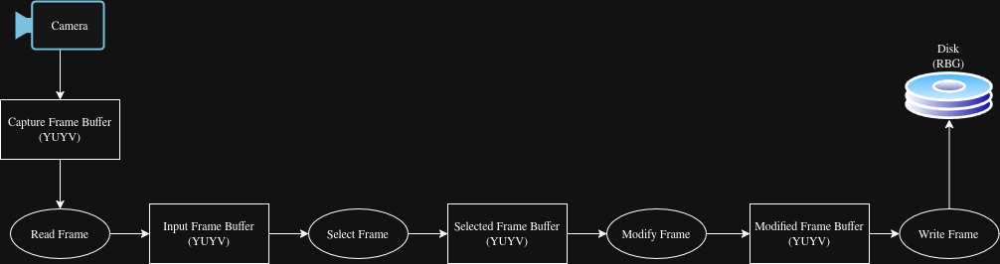

## Software Flowchart

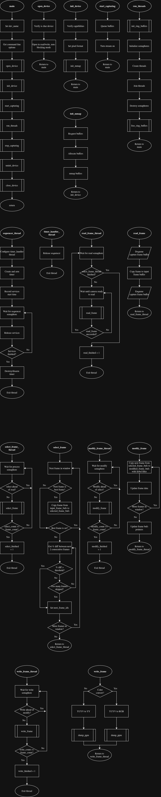

## Real-Time Requirements

| Service   | WCET (ms) | T (ms)    | D (ms)    | Core  |
| ---       | ---       | ---       | ---       | ---   |
| Read      |   3       |   33      |   33      | 2     | 
| Select    |  25       |  200      |  200      | 2     |
| Modify    |  30       |  500      |  500      | 2     |
| Write     | 500       | 1000      | 1000      | 2     |

$U = \frac{3}{33} + \frac{25}{200} + \frac{30}{500} + \frac{500}{1000} = 0.7759 = 77.59\%$

$LUB = m(2^{1/m} - 1) = 4(2^{1/4} - 1) = 0.7568 = 75.68\%$

### Timing Diagram

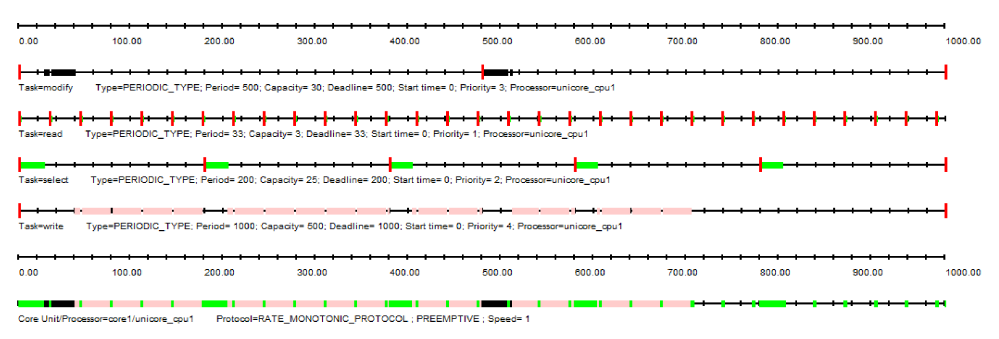

## Real-Time Analysis of Results

### Timing Analysis

#### 1-Hz Capture

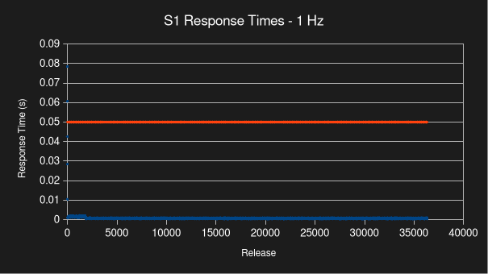

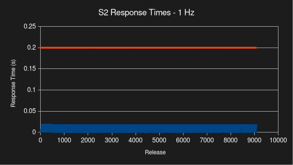

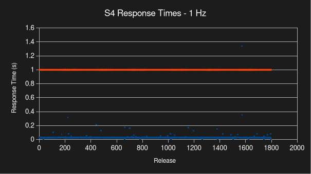

#### 1-Hz Capture with Processing

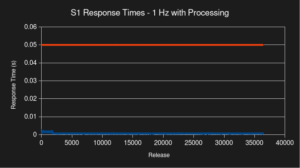

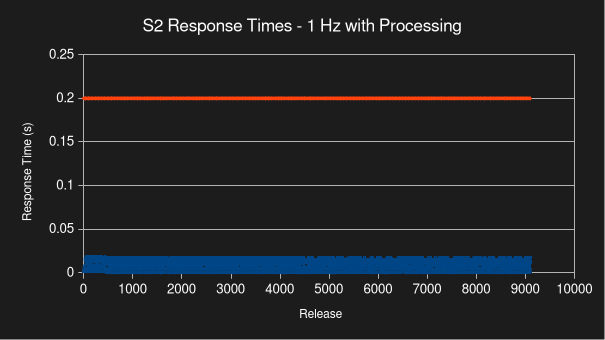

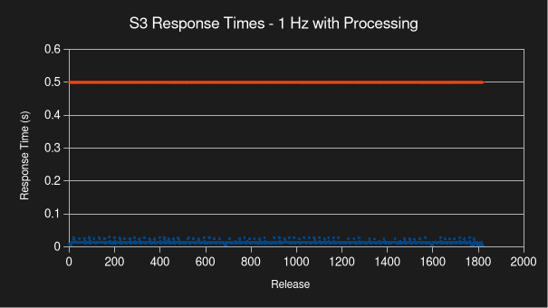

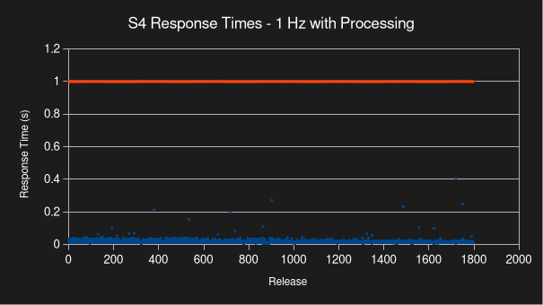

#### 10-Hz Capture

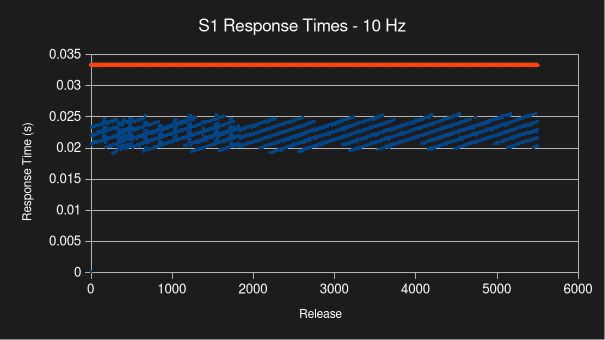

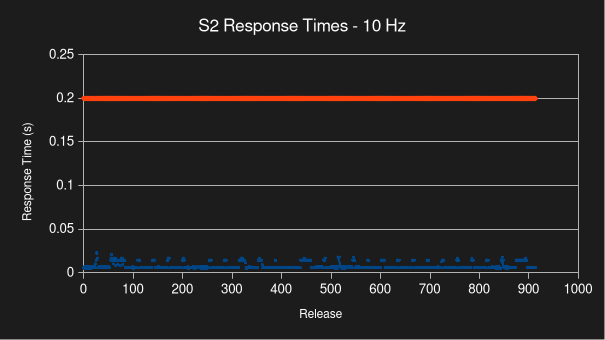

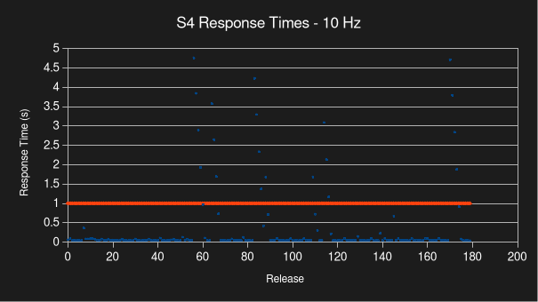

#### 10-Hz Capture with Processing

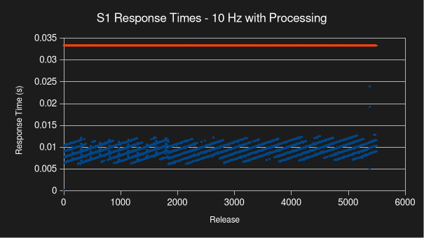

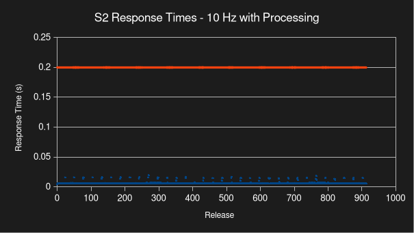

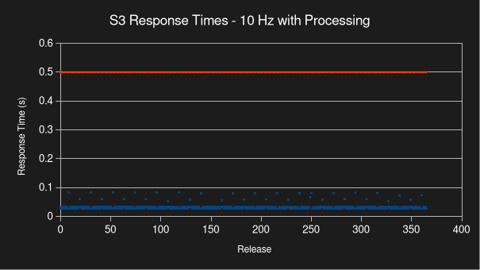

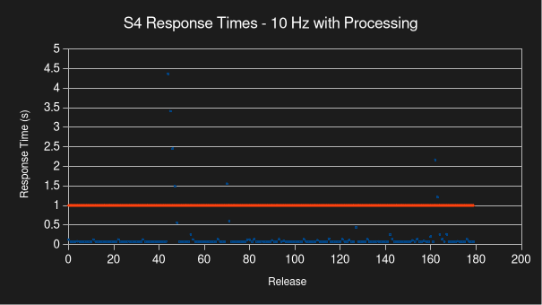

### Jitter and Drift Analysis

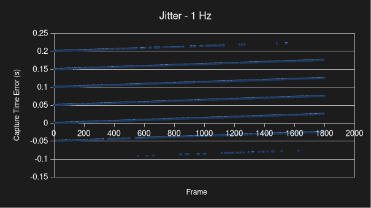

- $0.207688 - (-0.092216) = 0.29904 \approx 0.3 s$
- Jitter $\approx \pm 0.15 s$

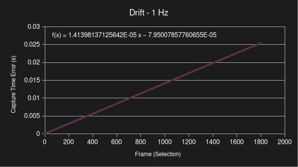

- Drift $= 14.140 {\mu}s/frame \times 1 frame/s = 14.140 {\mu}s/s$

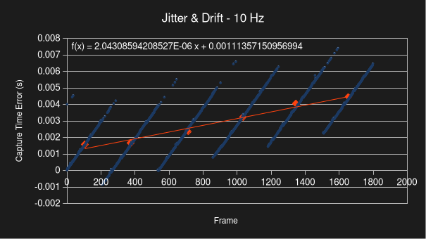

- $0.006566 s - 0 s = 0.006566 s$
- Jitter $\approx \pm 0.003283 s$
- Drift $\approx 2.043 {\mu}s/frame \times 10 frame/s = 20.431 {\mu}s/s$

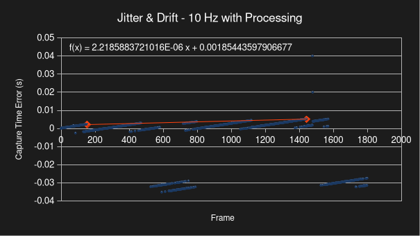

- Jitter $\approx \pm 0.04 s$
- Drift $\approx \frac{0.00505586 - 0.00219388}{1443 - 153}
  = 2.21859 {\mu}s/frame \times 10 frame/s = 22.186 {\mu}s/s$
